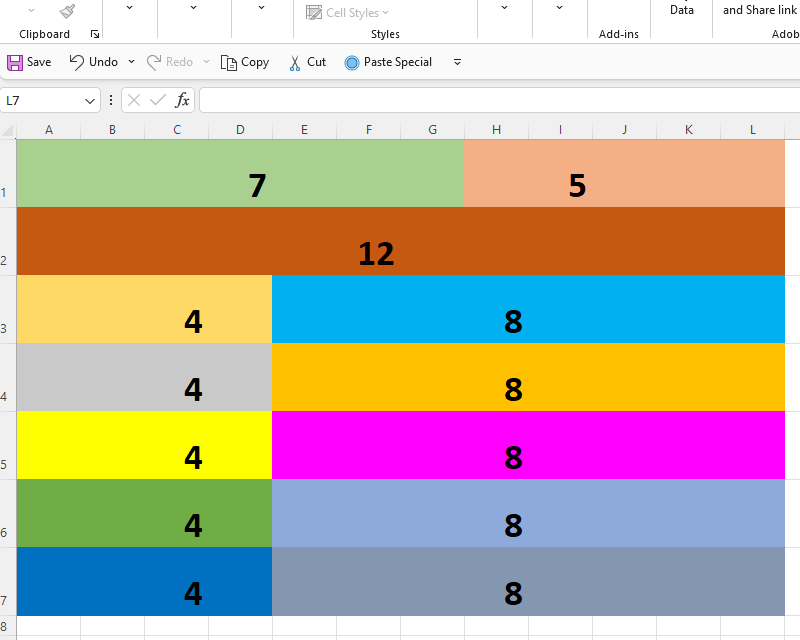
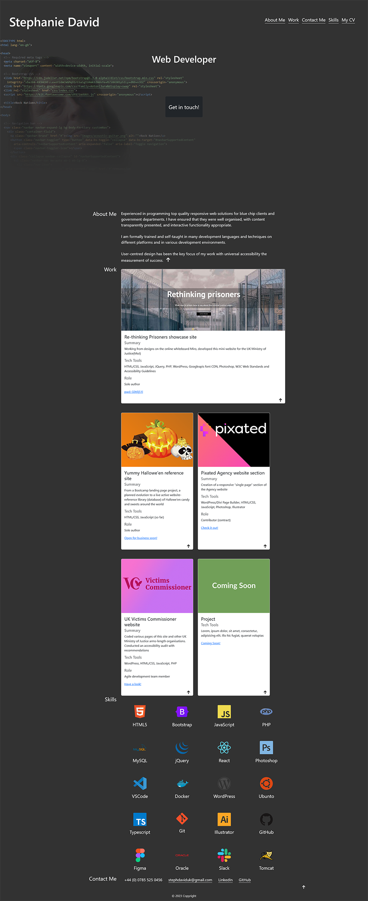

# Module 3 Challenge - UX and Advanced CSS: Bootstrap Portfolio

## A webpage using the Bootstrap front-end framework to showcase my skills and talents to prospective employers.

### Interesting features of this responsive Bootstrap HTML/CSS page:

* I had wanted to fork the portfolio repo, but learned that it’s not possible if it’s your own repo. Doing some research, I decided to adopt this suggestion from StackOverFlow.com:
> If you just want to create a new repository using all or most of the files from an existing one (i.e., as a kind of template), I find the easiest approach is to make a new repo with the desired name etc, clone it to your desktop, then just add the files and folders you want in it.
> You don't get all the history etc, but you probably don't want that in this case.
https://stackoverflow.com/questions/6613166/how-to-duplicate-a-git-repository-without-forking

* As the title name was specifically requested, I created a second repository naming it **Bootstrap Portfolio**.

* I used my Challenge-2 Portfolio page as a template. Would it have been better starting the Profile page again from scratch, as there was a lot of refactoring? On second thought, I don't think it would have been easier as I'm so accustomed to the HTML/CSS way of doing things, and there would still be relearning and at least as much refactoring. For me, Bootstrap is a "foreign" language, and there's a lot of literal translation i.e. "Franglais". Linguistically, speaking in a foreign language always has the flavour/accent, sometimes structure, of the speaker's native language. I think this applies to coding too. My maiden coding "tongue" is plain old CSS. :-) 

* I prepared a wireframe grid (based on Bootstrap's 12 col grid) for the overall page, and, later, one for the skills cards, in a MSExcel spreadsheet:
   
  
  
 
* A Fontawesome icon of an arrow pointing up made accessible using title nicely replaced the "back to menu" text - nicer look and feel.

* A dubious win is not requiring a separate css file but having everything in the html file - this flies in the face the "Separation of Concerns" principle.

* It's too easy to add too many divs. From time to time I refactored the code, replacing some of these divs into more semantic elements i.e. section, as well as removing redundant code.

* I validated the HTML at various points - validator.w3.org/ - throughout the development and continously checked its accessibility https://webaim.org/ - in doing so, buggy code was identified.

* To reduce the likihood of oversight errors - I made code changes in collections (e.g. skills cards) using VSCode's "find and replace all" feature.

* The accessibility of the fontawesome icons is achieved by adding a title attribute to the icon element - https://fontawesome.com/docs/web/dig-deeper/accessibility.

* I added the placeholder image - https://placehold.co/600x400 - as requested. It required an alt attribute. During periods of higher network traffic, the downloading of this image caused a significant delay in displaying the page.

* I believe that my commit comments will demonstrate the continuous refinements I made as the work proceeded, and my reworking of code elements - learning something new about Bootstrap as I went along. I replaced "old ways" of coding a navigation list to the Bootstrap way, and, subsequently, replaced that with a better or more appropriate Bootstrap approach. One benefit was the reduction of the need for nudges like margins and padding. You should see in the commit comments, the evolution of these elements i.e. the NavBar

* The discovery of https://devicon.dev/ was fortuitous. These icons worked best when inserted into Bootstrap cards.

* I found it counter-intuitive adding 'class="img-fluid"' to make a Bootstrap image responsive. It will apply max-width: 100%; and height: auto; to the image, which makes it always fit the parent element. 

* Understanding Bootstrap's breakpoints approach (sm-lg etc.) was gradual, as it is quite different from CSS's @media queries.

* The CSS approach to grids - particularly its 'grid-template-area property', is more advanced and pliable - https://weldebob.medium.com/moving-from-a-bootstrap-layout-to-css-grid-6edb0ec0e096.

* In conclusion, I'm not a fan of frameworks like Bootstrap that "reinvent the wheel" - naming elements and properties something other than what they're called in pain-old HTML/CSS. Also, Bootstrap's declarative nature, rather than imperative CSS, makes me uncomfortable, as does its being an all-pervasive framework - though from time to time Bootstrap lapses into vanilla CSS and this makes me smile. :-)

* But this was a good exercise, worth adding the skill to my cv as it's likely to be encountered in the "real world"

## Instructions

1. Create a new GitHub repositories and name it `Bootstrap-Portfolio`. :ballot_box_with_check:

2. Clone this repository to your computer. :ballot_box_with_check:

3. Inside your `Bootstrap-Portfolio` repo, create the folder structure for the webpage. 
   
   - Create a folder structure. :ballot_box_with_check:

     - Create a `index.html`. :ballot_box_with_check:

     - Create a `css` folder. :ballot_box_with_check:

       - Inside create a `style.css` file. :ballot_box_with_check: **(empty file)**

   - Create an `images` folder.

       - Place all your images in this folder. :ballot_box_with_check:

4. Using Bootstrap, recreate your portfolio site with the following items:

   The website should include the following bootstrap components:

    - A Navigation bar :ballot_box_with_check:
    
    - A navigation menu at the top. Feel free to use the navbar code provided in Bootstrap's documentation, or create your own navbar by applying the correct Bootstrap classes to your HTML. :ballot_box_with_check:

      - Include links that are applicable to your portfolio. :ballot_box_with_check:
  
        - Links should navigate to the appropriate sections  :ballot_box_with_check:

    - A hero section

        - A jumbotron featuring your picture, your name, and any other information you'd like to include. :ballot_box_with_check:

    - A work section

      - A section displaying your work in grid. :ballot_box_with_check:

        - If you need to use placeholder image use: https://placehold.co/ :ballot_box_with_check:

      - Use bootstrap cards for each project. :ballot_box_with_check:

        - The description should give a brief overview of the work. :ballot_box_with_check:
  
      - Each project will eventually link to your class project work! :ballot_box_with_check:

    - A skills section :ballot_box_with_check: 

      - List out the skills you expect to learn from the bootcamp. :ballot_box_with_check: **also included other relevant skills**

    - An about / contact section. :ballot_box_with_check:

      - An "About Me" section in the same row. :ballot_box_with_check:
    
    - A footer section. :ballot_box_with_check:

      - All hyperlinks should have a hover effect. :ballot_box_with_check:

      - All buttons should display a box shadow upon hover. **no buttons**

5. Your Bootstrap solution should minimize use of media queries. :ballot_box_with_check:

6. Deploy your new Bootstrap-powered portfolio to GitHub Pages :ballot_box_with_check:

## Screenshot of the page

  