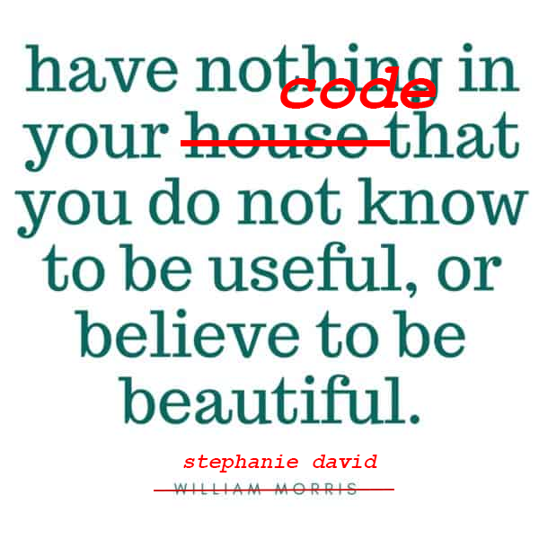

# Module 3 Challenge - UX and Advanced CSS: Bootstrap Portfolio

## A webpage using the Bootstrap front-end framework to showcase my skills and talents to prospective employers.

### Interesting features of this responsive HTML/CSS page:

* I had wanted to fork the portfolio repo, but it’s not possible if it’s your own repo. Doing some research, I decided to adopt this suggestion from StackOverFlow.com:
> If you just want to create a new repository using all or most of the files from an existing one (i.e., as a kind of template), I find the easiest approach is to make a new repo with the desired name etc, clone it to your desktop, then just add the files and folders you want in it.
> You don't get all the history etc, but you probably don't want that in this case.
https://stackoverflow.com/questions/6613166/how-to-duplicate-a-git-repository-without-forking

* accessibility icons title

* grid 12 cols

img

Add class .img-fluid to make your bootstrap image responsive. It will apply max-width: 100%; and height: auto; to the image, which makes it always fit the parent element. 

* Created a new repository - Bootstrap Portfolio - as this name was specifically requested
  
* Completed the page structure

* Am considering whether it would have been an easier task start again from scratch, as there was a lot of refactoring. But I don't think it would have been easier as I'm so accustomed to the HTML/CSS way of doing things. For me Bootstrap is definitely a "foreign" language and there's a lot of literal translation i.e. Fronglais going on. 
* 
* "Work" section images embedded in the HTML page rather than as a CSS background property. This enables the use of an alt tag and figure/figcaption tags - better for accessibility. The 02-hero-bg.jpg image was left as css property - it's decorative only. As well, it only appears with a larger screen. See @media queries below.

* Use of css grid and flex techniques. These are specific to the screen size.  See @media queries below.

* Use of @media queries - mobile first approach.

* Use of variable colors e.g. --altbkd: #adb3f0; Rather than using a color as the property, its function is used as its name. If a different look and feel is wanted - only the value of the property needs to be changed.

* Added "flex-direction: column" declaration for each li selecter in a ul list to appear on top of each other. For larger screen sizes "flex-direction: row" is used to allow li items to appear in a horizontal line. This is a good example of an @media query reversing/toggling the value of a property in the earlier (smaller/mobile) screensize.

* A separate "reset.css" page has been included.

* The HTML and CSS were validated: https://validator.w3.org/ https://jigsaw.w3.org/css-validator/.

* The page was evaluated for accessibility with the WebAim WAVE browser extension - https://wave.webaim.org/. The contrast issue - figcaption text - was fixed by applying a darker font colour.
  
### Issues:

These issues will be revisted:

* The grid and flex properties nearer the top of the page - even when the selector are used with specificity (e.g. with class or id or inheritance) in an attempt to prevent a "cascade" - interfere with later use of grid and flex causing some "funky" misbehaviour. Embedding the "Work" section images in the html started as a work-around, but actually, I think, it's a better accessible approach allowing for the use of the alt and figure/figcaption tags.
  
* Perhaps because of the above an attempt to use a responsive image - https://developer.mozilla.org/en-US/docs/Learn/HTML/Multimedia_and_embedding/Responsive_images - failed. I've left a commented-out placeholder in the html file.

